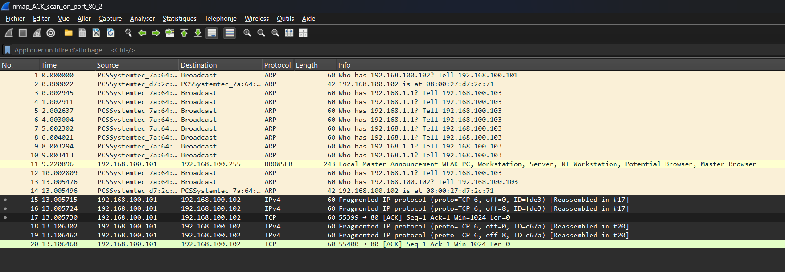
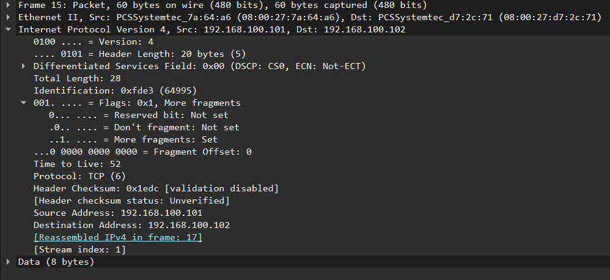
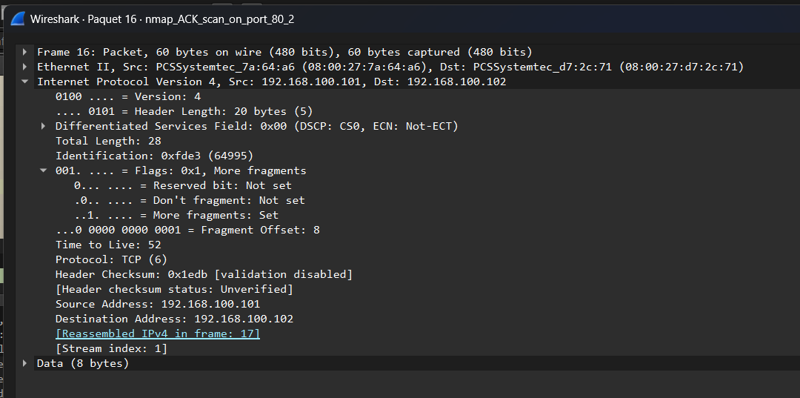
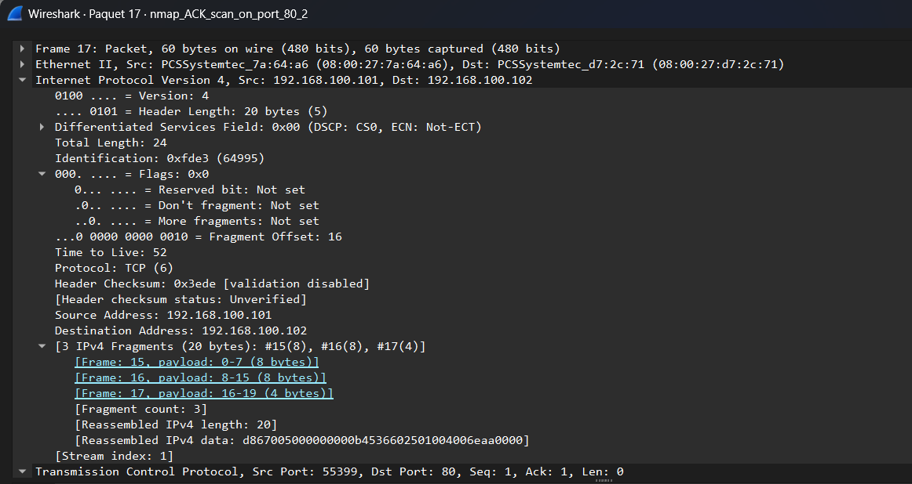

# NMap ACK Scan Analysis — Fragmentation + Spoofing Evasion (`nmap_ACK_scan_on_port_80_2`)

## Command Used (from README)

```
nmap -p80 -sA -Pn -f -S 192.168.100.101 -e eth0 192.168.100.102
```

- `-sA` = ACK scan
- `-p80` = port 80 only
- `-Pn` = skip ping
- `-f` = fragment packets
- `-S` = spoof source IP as 192.168.100.101
- `-e eth0` = specify network interface

## Why This Scan Exists — The Attacker's Logic

From the previous two scans the attacker now knows:

1. Target is alive and reachable (standard SYN scan)
2. A stateful firewall is present on port 80 (ACK scan)
3. Their IP address (.103) may be appearing in IDS/firewall logs

This scan combines two evasion techniques simultaneously: hiding the scan's nature **and** hiding the attacker's identity.

## Technique 1 — IP Fragmentation (`-f` flag)



Each ACK probe is deliberately split into 3 IP fragments before transmission, confirmed by Wireshark:

**Probe 1 (Identification: 0xfde3):**
- Packet 15: Fragment Offset 0, 8 bytes, More fragments = Set
- Packet 16: Fragment Offset 8, 8 bytes, More fragments = Set
- Packet 17: Fragment Offset 16, 4 bytes, More fragments = Not set
- Reassembled complete TCP header: 20 bytes

**Probe 2 (Identification: 0xc67a):**
- Packet 18: Fragment Offset 0, 8 bytes, More fragments = Set
- Packet 19: Fragment Offset 8, 8 bytes, More fragments = Set
- Packet 20: Fragment Offset 16, 4 bytes, More fragments = Not set
- Reassembled complete TCP header: 20 bytes

**Why this evades older IDS systems:** The TCP flags field (ACK bit) sits at byte 13 of the TCP header — inside the second fragment (bytes 8–15). An IDS inspecting fragments individually without reassembly sees only raw data with no identifiable flags in the first fragment, and cannot classify the traffic as an ACK scan. Only a system that reassembles all fragments before inspection can correctly identify this as a scan.







## Technique 2 — IP Spoofing (`-S 192.168.100.101`)

- **Real attacker IP:** 192.168.100.103
- **Spoofed source IP in all scan packets:** 192.168.100.101

Confirmed across all 6 fragment packets (15–20): every packet shows Source Address: 192.168.100.101. Any IDS alert, firewall log, or network record generated by this scan attributes the activity to .101, not the real attacker at .103.

**Additional confirmation:** Packet 11 shows .101 generating legitimate "Local Master Announcement" browser traffic — proving .101 is a real, active machine on the network, not a made-up IP. The attacker deliberately chose a live host to spoof, making the deception significantly harder to dismiss.

Because responses go to .101 not .103, the attacker cannot receive responses directly — but having already confirmed firewall behavior in the previous ACK scan, no response is needed here. The goal is evasion, not information gathering.

## Comparison to Previous ACK Scan

**Previous (`nmap_ACK_scan_on_port_80`):**
- 2 complete TCP packets
- Real source IP .103 visible
- No fragmentation
- Immediately identifiable as ACK scan

**This scan (`nmap_ACK_scan_on_port_80_2`):**
- 6 IPv4 fragments + 2 reassembled TCP packets
- Spoofed source IP .101 — real attacker hidden
- TCP header split across 3 fragments
- Flags field buried in fragment 2, invisible without reassembly

Same technique, same goal — two layers of active evasion added.

## Attacker Goal

Repeat the firewall-mapping ACK probe while evading both:
1. IDS detection via packet fragmentation hiding TCP flags
2. Attribution via IP spoofing hiding real attacker identity

Even if the IDS detects the scan, it investigates .101 instead of the real attacker at .103.

## Defender Detection & Mitigation

**Fragmentation evasion:** Modern IDS systems including properly configured Snort reassemble IP fragments before inspection, completely defeating this technique. This is why modern NMap users rarely rely on `-f` alone as an evasion method.

**IP spoofing:** Ingress filtering (BCP38/RFC2827) — router-level rules dropping packets whose source IP doesn't belong to the expected subnet — eliminates spoofed packets before they reach the target network entirely. Widely recommended but not universally implemented, which is why IP spoofing remains relevant in real attacks.

## Screenshots

1. `full-unfiltered-view.png` — Full unfiltered packet list (ARP, 6 IPv4 fragment packets, browser traffic)
2. `packet15-fragment1.png` — Fragment Offset: 0, More fragments: Set, Source: .101 (spoofed), Data: 8 bytes
3. `packet16-fragment2.png` — Fragment Offset: 8, More fragments: Set, Source: .101 (spoofed), Data: 8 bytes, same ID as fragment 1
4. `packet17-reassembled.png` — Fragment Offset: 16, More fragments: Not set, 3 IPv4 fragments reassembled (20 bytes total TCP header), TCP ACK confirmed at bottom of packet details
