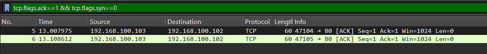
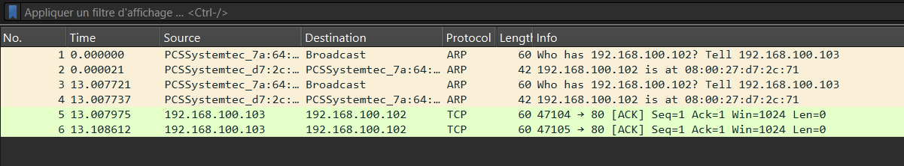
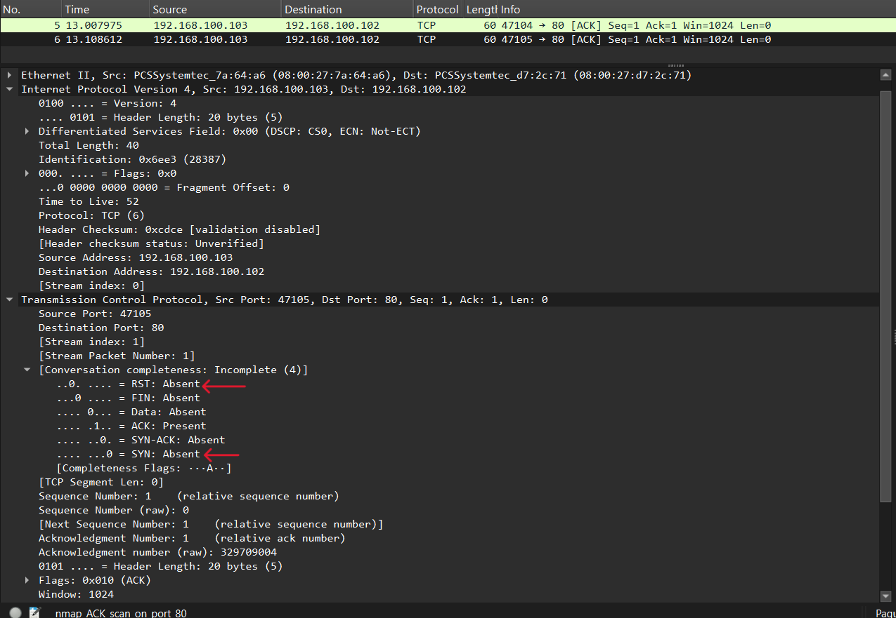

# NMap ACK Scan Analysis — Port 80 (`nmap_ACK_scan_on_port_80`)

## Command Used (from README)

```
nmap -p80 -sA -Pn 192.168.100.102
```

- `-sA` = ACK scan
- `-p80` = port 80 only
- `-Pn` = skip host discovery/ping

## Why ACK Scan, Not SYN Scan

A SYN scan answers "is this port open?" but cannot distinguish between a genuinely closed port and a port silently blocked by a firewall — both look identical (no response). An ACK scan solves this by exploiting TCP state rules: an ACK packet sent with no prior SYN is out-of-protocol-order.

- A non-firewalled target responds with RST ("I don't recognize this connection").
- A stateful firewall silently drops it entirely.

The presence or absence of an RST response reveals firewall behavior, not port status.

## Attack Flow

- **Source IP (attacker):** 192.168.100.103
- **Destination IP (target):** 192.168.100.102
- **Target port:** 80 (HTTP)
- **Filter applied:** `tcp.flags.ack==1 && tcp.flags.syn==0`



## Observed Pattern

Two lone ACK packets sent from attacker to target on port 80. No preceding SYN in either packet — confirming these are deliberately out-of-state probes, not part of a real connection. Source ports: 47104, 47105 (incrementing, consistent with NMap's source port behavior seen in the standard scan).

## Response Analysis

No RST response anywhere in the capture. Verified by removing the filter entirely — the full capture contains only ARP packets and these 2 TCP ACK packets. No other traffic exists.





## Conclusion

Absence of RST confirms target port 80 is behind a stateful firewall that silently drops out-of-state ACK packets rather than responding. A stateless firewall or unfiltered host would have returned RST. This tells the attacker: "There is a stateful firewall protecting this target."

## Comparison to Standard Scan

- **Standard scan (SYN)** → tells the attacker which ports are open/closed
- **ACK scan** → tells the attacker whether a stateful firewall exists and which ports it filters

These are complementary techniques, not alternatives.

## Attacker Goal

Determine whether a stateful firewall is present and actively filtering port 80, to inform next steps in the attack (choosing evasion techniques — exactly what the next capture demonstrates).

## Defender Detection

Two lone ACK packets with no corresponding SYN in session state tables is easily flagged by stateful IDS/IPS. Modern firewalls inherently block this by design (dropping out-of-state packets). However, the attacker already got their answer from just two packets — detection after the fact doesn't undo the reconnaissance.

## Screenshots

1. `filtered-ack-packets.png` — Filtered view (2 ACK packets)
2. `full-unfiltered-view.png` — Full unfiltered view (confirms only ARP + 2 TCP packets exist)
3. `packet-detail-flags.png` — Expanded packet showing TCP layer with flags + conversation completeness
