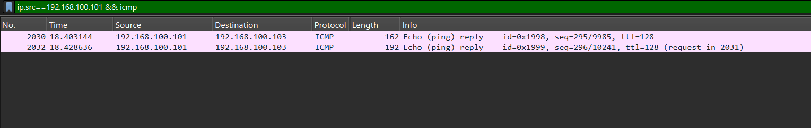
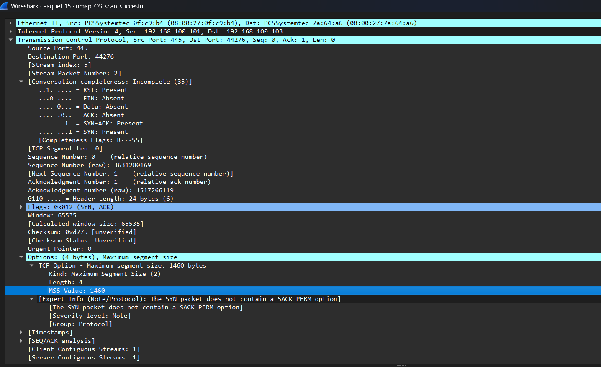
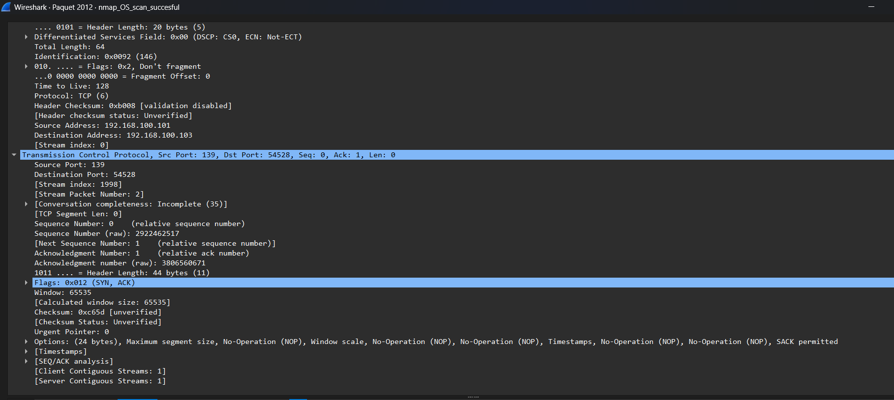
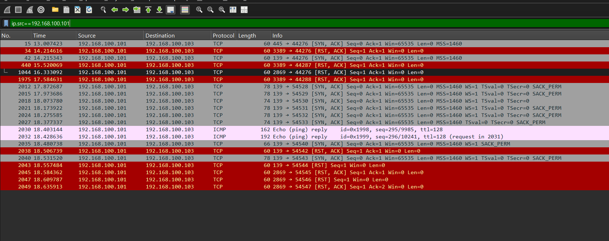
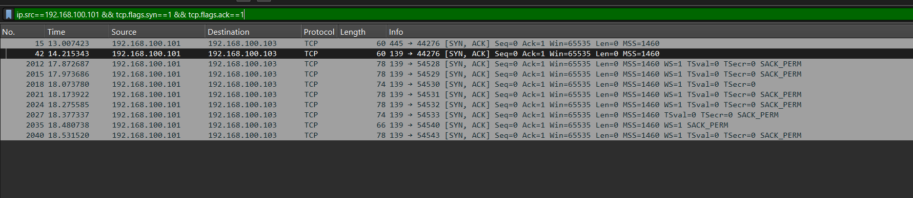
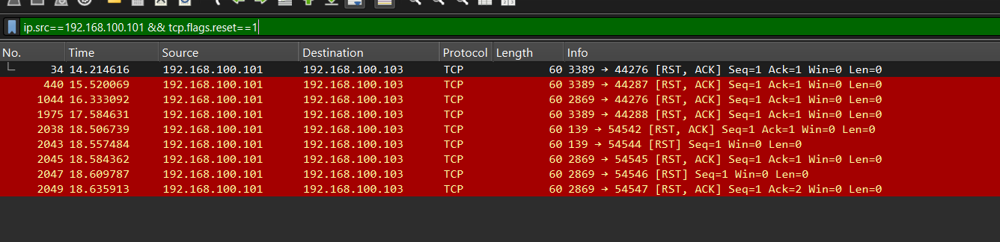
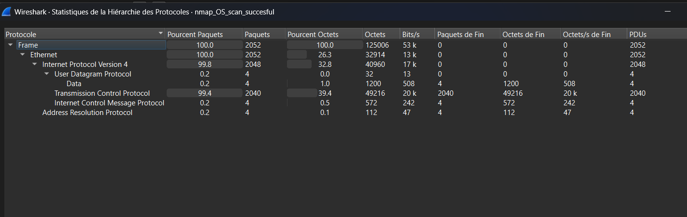

# NMap OS Fingerprint Scan — Successful (`nmap_OS_scan_succesful`)

## Command Used (from README)

```
nmap -O -Pn 192.168.100.101
```

- `-O` = OS detection
- `-Pn` = skip host discovery ping

## Target

192.168.100.101 — the zombie machine from the previous idle/zombie scan, now acting as the OS fingerprinting target. One open port and one closed port confirmed — providing the contrast NMap requires for successful fingerprinting.

## Why This Scan Succeeds Where the Previous Failed

The previous scan (against .102) received zero responses — all ports filtered, no contrast possible. This target (.101) has at least one open port (responding with SYN-ACK) and one closed port (responding with RST), giving NMap the response data it needs to compare against its OS database.

## OS Identification — Three Converging Indicators

### Indicator 1 — TTL = 128 (ICMP Replies)

**Filter:** `ip.src==192.168.100.101 && icmp`

Packets 2030 and 2032 show ICMP Echo replies with TTL=128. Linux systems start at TTL 64. Windows systems start at TTL 128. Since attacker and target are on the same local network (no router hops to decrement TTL), the value of 128 is the raw OS default — confirming a Windows system.



### Indicator 2 — TCP Window Size = 65535

All SYN-ACK responses show Window=65535. Windows XP and Windows 2000 use 65535 as their default TCP window size. Linux typically uses 5840 or 29200. Modern Windows versions use different values. This narrows the fingerprint to Windows XP/2000 era.

### Indicator 3 — Windows-Specific Open Ports

- Port 445 → SYN-ACK (OPEN) — SMB/Windows File Sharing
- Port 139 → SYN-ACK (OPEN) — NetBIOS Session Service
- Port 3389 → RST (CLOSED) — RDP/Remote Desktop Protocol
- Port 2869 → RST (CLOSED) — UPnP (Windows specific)

All four ports are Windows-specific services. No Linux or macOS system would have this exact combination of open and closed ports responding in this pattern.

### Conclusion: Windows XP (Most Likely SP3)

TTL 128 + Window 65535 + ports 445/139/3389/2869 is a textbook Windows XP fingerprint. Consistent with the capture date (2014) and VirtualBox lab environment.

## TCP Options Analysis (Open Port Fingerprint Data)

**Packet 15 (Port 445 SYN-ACK) — minimal options:**

Options: MSS=1460 only (4 bytes). No SACK, no timestamps, no window scale. Wireshark flags: "SYN packet does not contain SACK PERM option" — unusual, indicates older TCP stack behavior.



**Packet 2012 (Port 139 SYN-ACK) — full options:**

Options order: MSS, NOP, Window Scale, NOP NOP, Timestamps, NOP NOP, SACK permitted. Window Scale (WS=1), TSval=0, TSecr=0, SACK_PERM present.



The variation between these two SYN-ACK responses (one minimal, one full options) is itself a fingerprinting signal — different ports on the same Windows machine responding with different TCP option sets depending on which service is handling the connection.

## Attack Flow Confirmed

### Filter 1 — All Target Responses

**Filter:** `ip.src==192.168.100.101`

Shows bidirectional traffic confirming the target is responding — contrast with the failed scan where this filter returned nothing.



### Filter 2 — Open Port Responses (SYN-ACK)

**Filter:** `ip.src==192.168.100.101 && tcp.flags.syn==1 && tcp.flags.ack==1`

Ports 445 and 139 confirmed open via SYN-ACK responses. Multiple retransmissions visible as NMap re-probes each port.



### Filter 3 — Closed Port Responses (RST)

**Filter:** `ip.src==192.168.100.101 && tcp.flags.reset==1`

Ports 3389, 139 (in some probe rounds), and 2869 confirmed closed via RST responses. The contrast between SYN-ACK (open) and RST (closed) gives NMap its fingerprint data.



### Filter 4 — ICMP Responses

**Filter:** `ip.src==192.168.100.101 && icmp`

Two ICMP Echo replies (packets 2030, 2032) with TTL=128. Target responds to ICMP unlike .102, which dropped all pings.

## Protocol Hierarchy Comparison

| Protocol | Failed Scan (.102) | Successful Scan (.101) |
|---|---|---|
| TCP | 98.4% (2024 pkts) | 99.4% (2040 pkts) |
| ICMP | 0.8% (16 pkts) | 0.2% (4 pkts) |
| UDP | 0.5% (10 pkts) | 0.2% (4 pkts) |
| **Total frames** | **2056** | **2052** |

Key difference: the successful scan has TCP responses FROM the target — the failed scan had zero returning packets. The bidirectional TCP traffic is what enables fingerprinting.



## Attacker Goal

Identify the target operating system to select appropriate exploits. Successfully determined: Windows XP (likely SP3). With this information, the attacker can now target known Windows XP vulnerabilities (e.g. MS08-067, EternalBlue/MS17-010 if applicable) rather than attempting generic exploits.

## Defender Detection & Mitigation

OS fingerprinting is difficult to prevent entirely without also blocking legitimate traffic — since it exploits normal TCP/IP behavior rather than protocol violations.

Partial mitigations:

- **Firewall default-deny** (demonstrated in the failed scan) — silently dropping all probes prevents fingerprinting completely, even if it also blocks legitimate access
- **IP ID randomization** — already standard on modern OS
- **TCP option normalization** — some IPS/firewall products normalize TCP options in responses, masking OS-specific signatures from external observers
- **Network segmentation** — limiting which hosts can reach sensitive machines reduces fingerprinting attack surface
- **Patch management** — OS fingerprinting is only dangerous if the identified OS has unpatched vulnerabilities. Keeping systems updated reduces the value of the attacker's fingerprint information.

## Screenshots

1. `all-target-responses.png` — All target responses (filter 1)
2. `synack-open-ports.png` — SYN-ACK open port responses (filter 2)
3. `rst-closed-ports.png` — RST closed port responses (filter 3)
4. `icmp-replies-ttl128.png` — ICMP replies showing TTL=128 (filter 4)
5. `protocol-hierarchy.png` — Protocol Hierarchy breakdown
6. `packet15-tcp-options.png` — Packet 15 TCP options (port 445, minimal options)
7. `packet2012-tcp-options.png` — Packet 2012 TCP options (port 139, full options)
