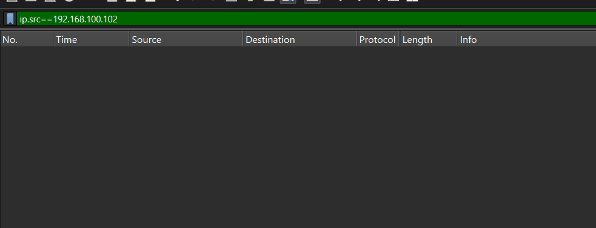
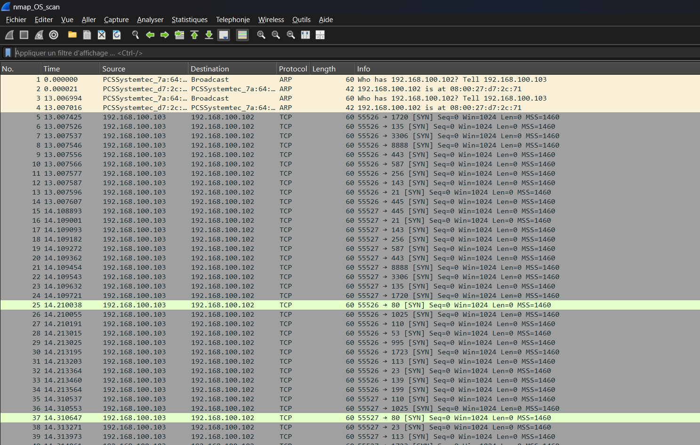
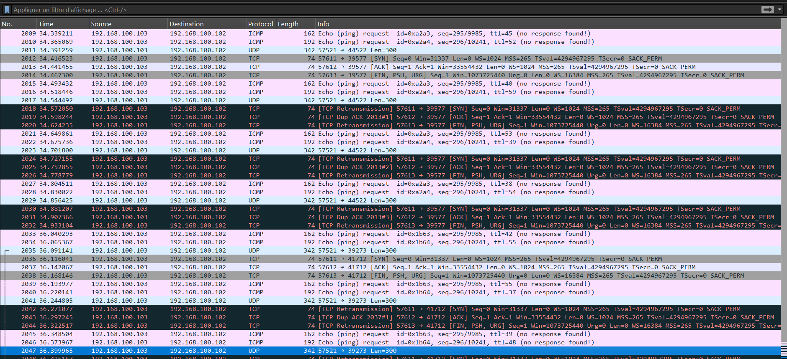
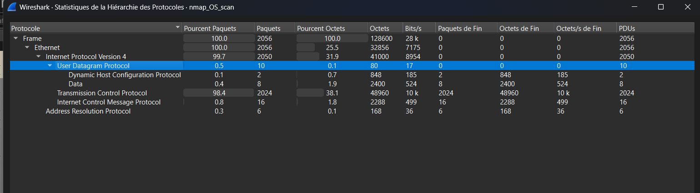

# NMap OS Fingerprint Scan — Failed (`nmap_OS_scan`)

## Command Used (from README)

```
nmap -O -Pn 192.168.100.102
```

- `-O` = OS detection
- `-Pn` = skip host discovery ping

## Why OS Fingerprinting Matters to an Attacker

Knowing a port is open is not enough — the same port on Windows Server 2019 vs Ubuntu 22.04 has completely different vulnerabilities and exploits. OS fingerprinting lets the attacker choose the right weapon for the right target.

## How NMap Fingerprints an OS

NMap sends multiple specially crafted probe types and compares responses against a database of known OS signatures:

- **TCP SYN probes** → analyzes SYN-ACK response flags, window size, TCP options order
- **Malformed TCP flag probes (FIN/PSH/URG)** → different kernels handle illegal flag combinations differently
- **ICMP echo requests with varying TTL** → starting TTL value and response format reveals OS family
- **UDP probes to closed ports** → ICMP "port unreachable" format varies by OS implementation

NMap needs contrast between an OPEN port response (SYN-ACK) and a CLOSED port response (RST) to make its fingerprint determination. Without both, it cannot distinguish between OS signatures.

## Why This Scan Failed

**Target:** 192.168.100.102 — all ports filtered by firewall

Filter `ip.src==192.168.100.102` returns zero packets — the target sent no response of any kind to any probe type.



The firewall implements a complete default-deny policy:

- **TCP SYN** → silently dropped (no SYN-ACK, no RST)
- **Malformed TCP flags** → silently dropped (no RST, no ICMP)
- **ICMP echo requests** → silently dropped (no ping reply) — confirmed by Wireshark's "(no response found!)" label
- **UDP probes** → silently dropped (no ICMP port unreachable)

With all ports filtered and zero responses received, NMap has no data to analyze. The required contrast between open and closed port responses is impossible to establish — fingerprinting fails completely.

## Retransmission Behavior

Total capture: 2056 packets, all from .103 → .102. NMap retried each probe multiple times after receiving no response, inflating the packet count significantly. Each probe block repeats: SYN → Retransmission → Dup ACK → FIN/PSH/URG Retransmission → ICMP x2 → UDP.



## Probe Types Confirmed (Statistics → Protocol Hierarchy)

Total frames: 2056 — all outgoing from attacker (.103) to target (.102), zero returning.

- **TCP:** 98.4% (2024 packets) — dominant probe type, includes SYN probes, malformed flag combinations (FIN/PSH/URG), ACK probes, and their retransmissions
- **ICMP:** 0.8% (16 packets) — echo request probes with varying TTL values, all marked "(no response found!)" by Wireshark
- **UDP:** 0.5% (10 packets) — probes to closed ports designed to trigger ICMP port unreachable responses (none received)
- **ARP:** 0.3% (6 packets) — normal background traffic
- **DHCP:** 0.1% (2 packets) — normal background traffic





NMap used all three transport-layer protocols (TCP, UDP, ICMP) in its fingerprinting attempt — and received zero responses across all three. This confirms the firewall implements protocol-agnostic filtering, not just TCP port blocking.

## Attacker Goal

Identify the target operating system to select appropriate exploits. Failed due to complete firewall filtering — attacker gains zero OS information from this scan.

## Defender Perspective

A default-deny firewall policy that silently drops ALL probe types (TCP, UDP, ICMP) is the most effective defense against OS fingerprinting. Silent dropping reveals nothing — not even confirmation that a host exists at that IP. This is significantly more secure than returning RST or ICMP errors, which at minimum confirm host presence.

## Screenshots

1. `early-packets-probe-pattern.png` — Early packets showing the repeating SYN/retransmission/ICMP/UDP probe pattern
2. `probe-variety-tcp-icmp-udp.png` — Evidence of all three transport-layer probe types being used
3. `zero-responses-filter.png` — Filtered view confirming zero responses from the target
4. `protocol-hierarchy.png` — Protocol Hierarchy breakdown (TCP/ICMP/UDP/ARP/DHCP percentages)
