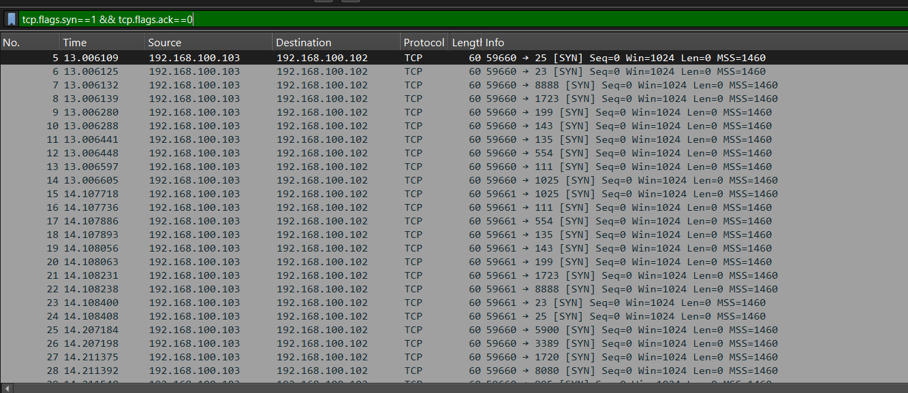
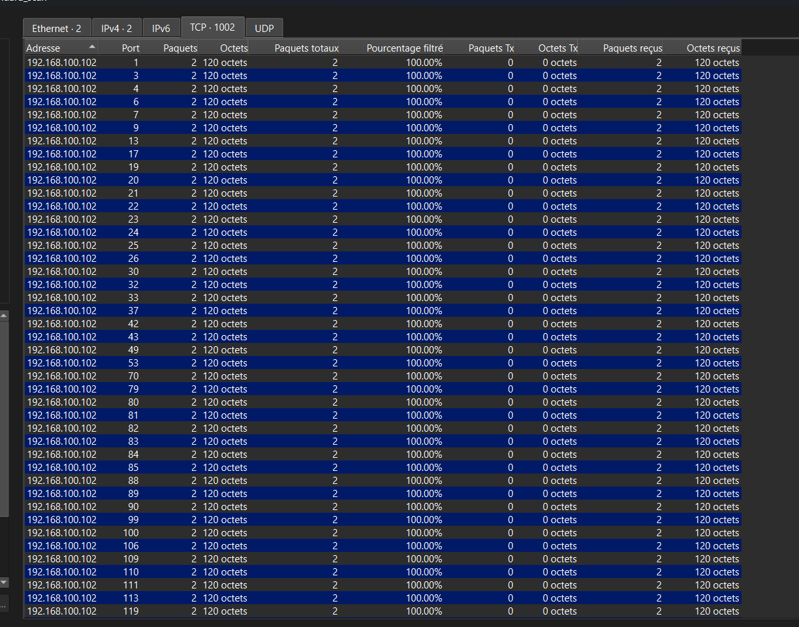

# NMap Standard Scan Analysis (`nmap_standard_scan`)

## Command Used (from README)

```
nmap 192.168.100.102
```

Default NMap settings — SYN scan by default.

## Attack Flow

- **Source IP:** 192.168.100.103
- **Destination IP:** 192.168.100.102
- **Filter applied:** `tcp.flags.syn==1 && tcp.flags.ack==0`



## Observed Pattern

A single source IP repeatedly sends SYN packets to a single destination IP, cycling rapidly through different destination ports (e.g. 25, 23, 8888, 1723, 199, 143, 135, 554, 111, 1025). Time intervals between packets are sub-millisecond, indicating automated, rapid probing rather than manual/legitimate connection attempts.

## Source Port Behavior

The source port stays largely consistent within a batch (e.g. 59660) before incrementing for the next batch (59661) — a fingerprint of NMap's internal port-reuse behavior across scan rounds.

## Port Selection Logic

Destination ports are not random — they correspond to NMap's default "top ports" list, prioritizing commonly-open services (e.g. 23 = Telnet, 25 = SMTP, 111/135 = RPC, 143 = IMAP, 554 = RTSP, 1723 = PPTP). This reflects an efficiency-driven scanning strategy rather than brute-force scanning of all 65535 ports.

## Why This Confirms a Scan (Not Legitimate Traffic)

No corresponding SYN-ACK responses appear in the filtered view, and no actual application data follows any SYN packet. This confirms reconnaissance behavior — the goal is port discovery, not establishing a real connection.

## Statistics → Endpoints

Confirmed with "Limit to display filter" ticked.

- **Total unique destination ports probed:** 1002
- **Filter applied:** `tcp.flags.syn==1 && tcp.flags.ack==0`
- **Each port:** exactly 2 packets, 120 octets — uniform across all 1002 entries, confirming automated/scripted scan behavior



## Attacker Goal

Map open/listening services on the target without completing full TCP handshakes, minimizing footprint while gathering reconnaissance on potential attack surfaces.

## Defender Detection

A high volume of SYN packets from a single source IP, targeting many different destination ports in a short time window, is a classic IDS/IPS signature for port scan detection (e.g. Snort's built-in portscan preprocessor). Rate-limiting or alerting on this pattern is standard mitigation.

## Additional Observation

Every probed port shows an identical packet/byte pattern (2 packets, 120 octets), reflecting fully automated, scripted scan behavior rather than manual interaction.

## Screenshots

1. `syn-filtered-view.png` — Filtered packet list (SYN-only view)
2. `endpoints-tcp.png` — Statistics → Endpoints TCP tab (showing 1002 entries)
