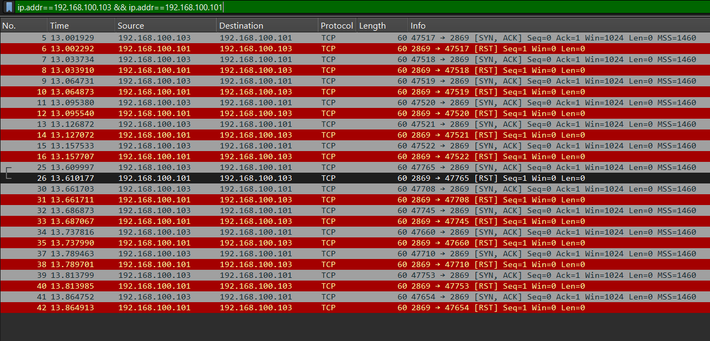
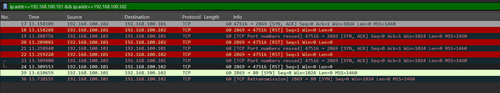
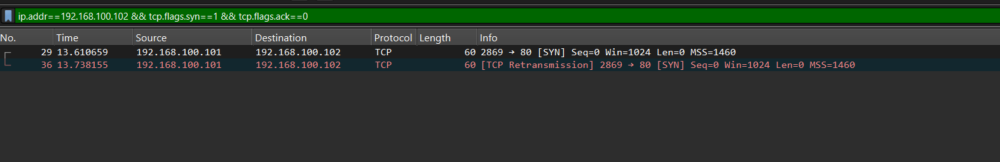
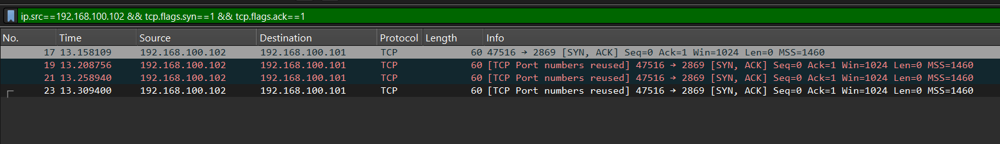
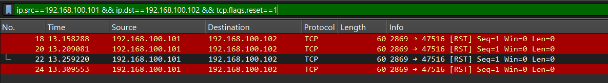

# NMap Zombie/Idle Scan Analysis (`nmap_zombie_scan`)

## Command Used (from README)

```
nmap -p80 -Pn -sI 192.168.100.101:2869 192.168.100.102
```

- `-sI` = idle/zombie scan using .101:2869 as zombie
- `-p80` = target port 80
- `-Pn` = skip ping

## Three Machines

- **192.168.100.103** — real attacker (never contacts target directly)
- **192.168.100.101** — zombie (innocent third party, exploited)
- **192.168.100.102** — target (only ever sees .101, never .103)

## Core Mechanism — IP ID Sequence Exploitation

Each IP packet carries an Identification field that increments predictably on older/idle systems. The attacker exploits this counter to infer whether the target port is open or closed without ever contacting the target directly:

- **Open port** → target sends SYN-ACK to zombie → zombie RSTs it → zombie's IP ID increments → attacker reads increment → OPEN
- **Closed port** → target sends RST to zombie → zombie ignores it → zombie's IP ID unchanged → attacker reads no change → CLOSED

## Attack Flow — Confirmed by Wireshark

### Phase 1 — Attacker Probes Zombie IP ID

**Filter:** `ip.addr==192.168.100.103 && ip.addr==192.168.100.101`

.103 sends repeated SYN-ACK to .101 on port 2869. .101 responds with RST each time — confirming current IP ID. Pattern repeats continuously between all scan probes. Port 2869 chosen specifically because it reliably generates RST responses, making the IP ID readable.



### Combined View — Zombie–Target Channel

**Filter:** `ip.addr==192.168.100.101 && ip.addr==192.168.100.102`

Shows the full exchange between the zombie and the target in one view — both the spoofed SYN and the target's resulting SYN-ACK/RST traffic, before isolating each direction individually below.



### Phase 2 — Spoofed SYN Sent to Target

**Filter:** `ip.addr==192.168.100.102 && tcp.flags.syn==1 && tcp.flags.ack==0`

Packets 29 and 36 — source .101 → destination .102, port 80, SYN only. Real sender is .103 with spoofed source IP. Packet 36 is a TCP retransmission — NMap retried because no direct response reaches .103 (responses go to .101).



### Phase 3 — Target Responds to Zombie (Port Open Confirmed)

**Filter:** `ip.src==192.168.100.102 && tcp.flags.syn==1 && tcp.flags.ack==1`

Packets 17, 19, 21, 23 — .102 sends SYN-ACK to .101. Target believes .101 initiated the connection. Repeated retransmissions confirm the target kept waiting for a handshake that .101 never completes. Port 80 is OPEN — confirmed by SYN-ACK response.



### Phase 4 — Zombie RSTs the Unexpected SYN-ACKs

**Filter:** `ip.src==192.168.100.101 && ip.dst==192.168.100.102 && tcp.flags.reset==1`

Packets 18, 20, 22, 24 — .101 RSTs each SYN-ACK from .102. The zombie has no record of initiating this connection, so it rejects each SYN-ACK automatically via standard TCP behavior. Each RST increments .101's IP ID counter by 1. The attacker reads these increments on the .103↔.101 channel to confirm port 80 is open on the target.



## Why the README Calls the Zombie Channel "Noisy"

The .103↔.101 probing traffic generates many packets — the attacker must probe the zombie's IP ID before AND after each target probe to detect the increment. This creates obvious heavy traffic between attacker and zombie that a network monitor watching .103 would notice immediately. However, from .102's perspective, only .101 communicated with it — .103 remains completely invisible to the target.

## Conclusion — Port Status

**Port 80 on 192.168.100.102: OPEN**

Evidence: 4 SYN-ACK responses from .102 to .101 confirm the target accepted the connection attempt, consistent with an open port responding to a SYN probe.

## Attacker Goal

Scan the target port completely anonymously — the target's logs, IDS alerts, and firewall records show only .101 as the scanner. The real attacker at .103 never appears in any target-side record. Even if the target detects the scan, they investigate the wrong machine.

## Defender Detection & Mitigation

**From target side:** extremely difficult to detect since traffic appears to come from a legitimate machine (.101). The pattern of SYN with no completed handshake and repeated RSTs from .101 could flag as suspicious if .101's behavior is monitored.

**From network side:** the noisy .103↔.101 channel is the vulnerability — heavy SYN-ACK/RST probing traffic on port 2869 between two internal machines with no application context is anomalous and detectable by a network IDS.

- **Ingress filtering (BCP38)** prevents externally-sourced zombie scans by dropping packets with spoofed source IPs at the router before they reach the target network.
- **IP ID randomization** on modern operating systems defeats this attack entirely — if the zombie's IP ID is random rather than sequential, the attacker cannot use it as a counter to infer port status. All modern OS kernels randomize IP ID by default, making zombie scans non-functional against current systems.

## Screenshots

1. `filter1-attacker-zombie-channel.png` — Attacker↔zombie IP ID probing (Phase 1)
2. `filter2-zombie-target-channel.png` — Combined zombie↔target channel overview
3. `filter3-spoofed-syn-to-target.png` — Spoofed SYN sent to target (Phase 2)
4. `filter4-target-synack-responses.png` — Target's SYN-ACK responses to zombie (Phase 3)
5. `filter5-zombie-rst-to-target.png` — Zombie's RST responses to target (Phase 4)
