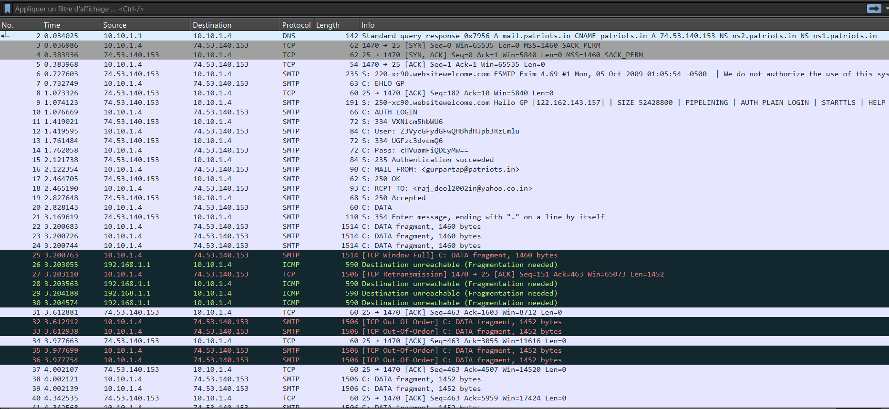
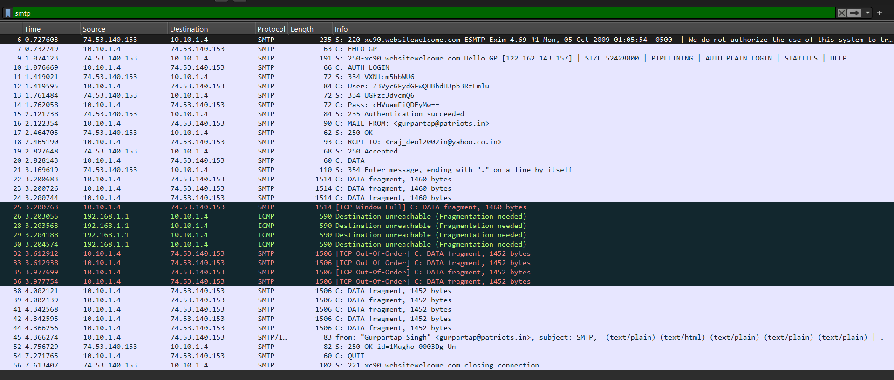
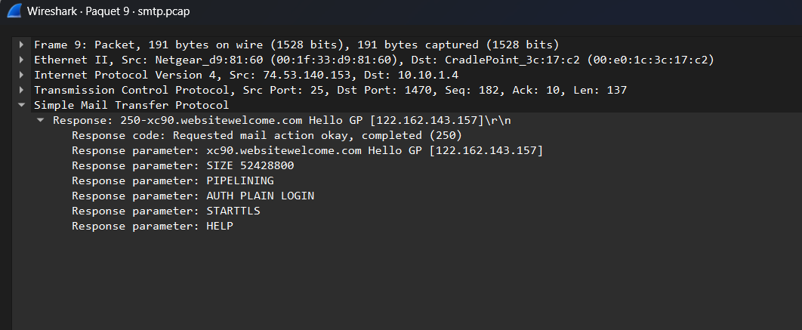
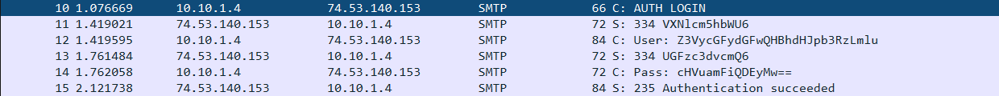
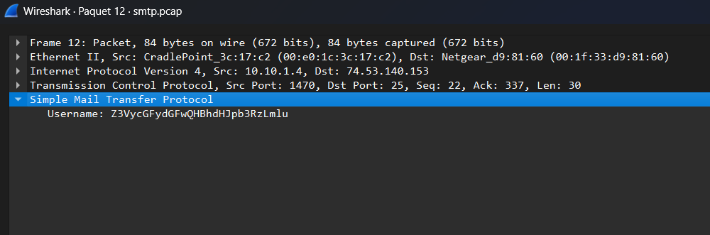
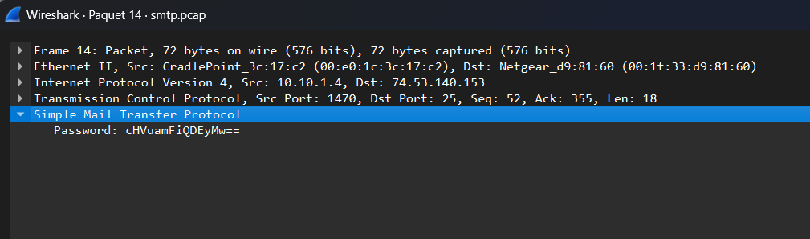
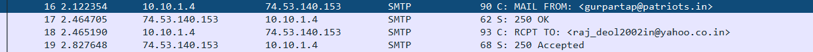

# SMTP Cleartext Credential Interception Analysis (`smtp.pcap`)

## Source

Official Wireshark sample capture (wiki.wireshark.org/SampleCaptures).

## Why SMTP Is Vulnerable By Design

SMTP was designed in the early 1980s, when the internet was a small, trusted network of research institutions. Confidentiality was never part of the original design — including the authentication step where a mail client proves its identity to the server. Unless an environment explicitly layers encryption on top (SMTPS or STARTTLS), SMTP authentication and message content are transmitted in plaintext by default.

## Capture Overview

The capture contains 60 frames, mixed protocols: DNS, TCP, SMTP, ICMP, and BROWSER. Traffic runs primarily between `10.10.1.4` (client) and `74.53.140.153` (mail server, `xc90.websitewelcome.com`), with some unrelated ICMP/DNS/ARP background traffic.



## Isolating the SMTP Conversation

**Filter:** `smtp`

This strips out the TCP/ICMP/DNS noise and shows only the SMTP protocol exchange — server banner, EHLO greeting, authentication, mail transaction, and message delivery.



## Server Capabilities — Encryption Was Available

**Packet 9** shows the server's response to `EHLO`, listing its supported extensions:

```
250-xc90.websitewelcome.com Hello GP [122.162.143.157]
SIZE 52428800 | PIPELINING | AUTH PLAIN LOGIN | STARTTLS | HELP
```

The server explicitly advertises `STARTTLS` as an available option. This is an important detail: encryption was *possible* for this session — the client simply never invoked it, proceeding instead with plaintext `AUTH LOGIN`.



## The AUTH LOGIN Sequence

**Packets 10–15:**

```
10  C: AUTH LOGIN
11  S: 334 VXNlcm5hbWU6                 ("Username:" in Base64)
12  C: User: Z3VycGFydGFwQHBhdHJpb3RzLmlu
13  S: 334 UGFzc3dvcmQ6                 ("Password:" in Base64)
14  C: Pass: cHVuamFiQDEyMw==
15  S: 235 Authentication succeeded
```

Both the username and password are sent as Base64-encoded strings — not encrypted. Base64 is not a cipher; it is simply a way of representing arbitrary data as printable ASCII, originally intended so email systems could reliably carry binary data. It has no key and no cryptographic property. Anyone observing this traffic can reverse it back to plaintext instantly.



### Packet 12 — Username Field

```
Simple Mail Transfer Protocol
    Username: Z3VycGFydGFwQHBhdHJpb3RzLmlu
```



### Packet 14 — Password Field

```
Simple Mail Transfer Protocol
    Password: cHVuamFiQDEyMw==
```



## Decoding the Credentials

Decoding both Base64 strings directly:

```
Username: gurpartap@patriots.in
Password: punjab@123
```

No cracking, brute force, or exploit was required — a single Base64 decode operation recovers valid, working credentials. **Packet 15** confirms `235 Authentication succeeded`, proving these are real, functioning login credentials, not a failed guess.

## Beyond the Password — Message Metadata Is Exposed Too

**Packets 16–19:**

```
16  C: MAIL FROM: <gurpartap@patriots.in>
17  S: 250 OK
18  C: RCPT TO: <raj_deol2002in@yahoo.co.in>
19  S: 250 Accepted
```

The sender and recipient addresses are visible in cleartext immediately after authentication. Packet 45 further reveals the message's `From` header, subject line, and MIME structure (`text/plain`, `text/html` multipart) — meaning an observer captures not just the login, but who is emailing whom, and can access the message content itself.



## Attacker Perspective

No active technique is required here — this is passive interception. Anyone positioned to observe the traffic (a compromised switch, a rogue Wi-Fi access point, an ISP, or another host on a shared network segment) can capture this session and recover valid mail credentials with zero effort. The credentials can then be reused to send mail as the victim, access their inbox (if the same password is reused elsewhere), or pivot into further compromise.

## Defender Detection & Mitigation

- **Enforce STARTTLS**: reject `AUTH LOGIN`/`AUTH PLAIN` over an unencrypted connection; require the TLS handshake before authentication is permitted
- **Disable plaintext AUTH mechanisms** entirely where not required for legacy compatibility
- **Use implicit TLS (SMTPS, port 465)** instead of relying on opportunistic STARTTLS upgrades, since STARTTLS can be stripped by an active on-path attacker if not properly enforced
- **Network-level detection**: monitor for AUTH LOGIN/PLAIN sequences occurring without a preceding TLS handshake, which is a straightforward signature for cleartext credential exposure

## Screenshots

1. `unfiltered-overview.png` — Full unfiltered packet list (mixed protocols, overall capture)
2. `smtp-filtered-view.png` — Packet list filtered to `smtp`
3. `auth-login-sequence.png` — Packet list rows 10–15 (AUTH LOGIN through Authentication succeeded)
4. `packet12-username-detail.png` — Packet 12 expanded, showing raw Base64 username field
5. `packet14-password-detail.png` — Packet 14 expanded, showing raw Base64 password field
6. `server-capabilities-starttls.png` — Packet 9, showing AUTH PLAIN LOGIN and STARTTLS advertised
7. `email-metadata-exposed.png` — Packet list rows 16–19 (MAIL FROM, RCPT TO, cleartext addressing)
