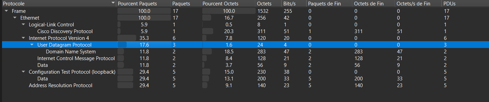
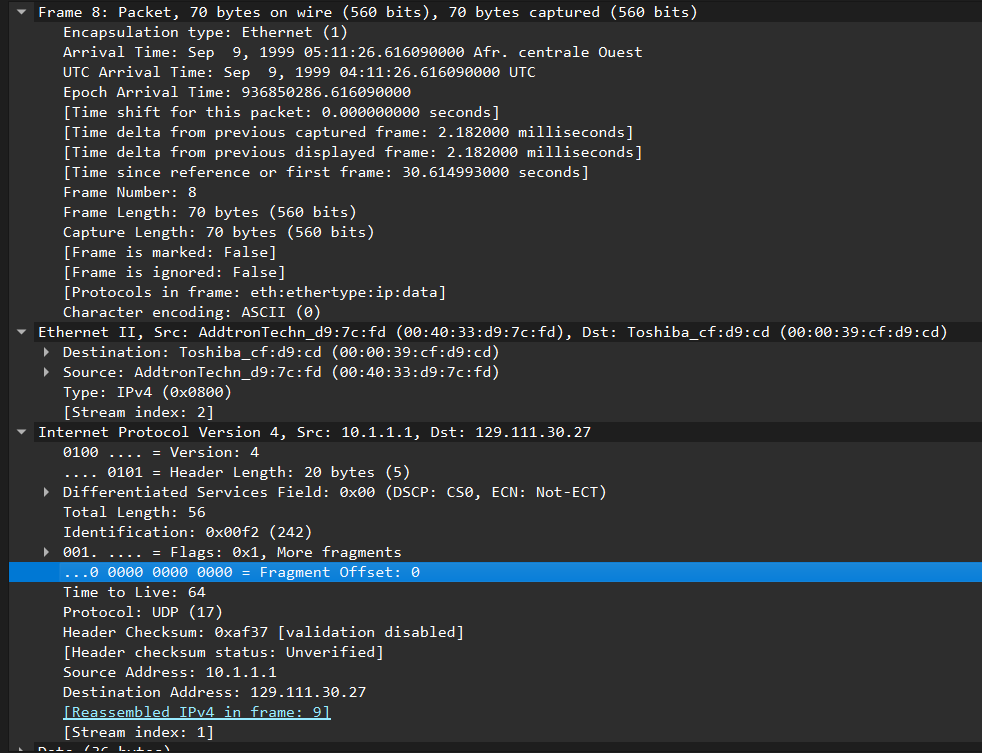
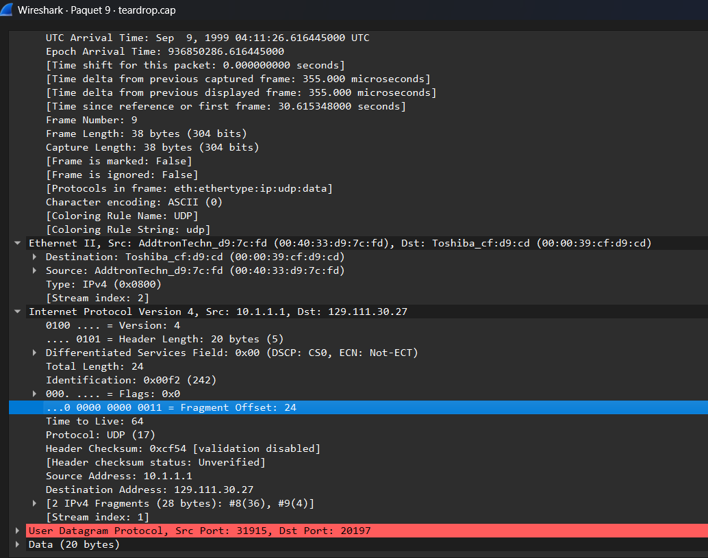
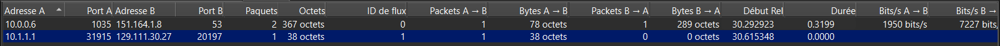

# Teardrop Attack Analysis (`teardrop.cap`)

## Protocol Overview

The capture contains 17 frames total, with mixed protocols: Cisco Discovery Protocol, IPv4 (UDP, DNS, ICMP), Configuration Test Protocol (loopback), and ARP. The relevant attack traffic is isolated to the UDP stream between `10.1.1.1` and `129.111.30.27`.



## Attack Flow

- **Source IP:** 10.1.1.1
- **Destination IP:** 129.111.30.27
- **Source Port:** 31915
- **Destination Port:** 20197
- **Protocol:** UDP

Both ports are dynamic/arbitrary — irrelevant to the attack mechanism, since the exploit occurs at the IP layer during fragment reassembly, before any port-based delivery happens.

## Fragment Evidence

### Frame 8

- Total Length: 56 bytes
- Fragment Offset: 0
- Flags: More Fragments = set
- Payload range: 0–35 (36 bytes)



### Frame 9

- Fragment Offset: 24
- Payload range: 24–27 (4 bytes of payload, starting at offset 24)



## Overlap Proof

Frame 8 covers payload bytes 0–35. Frame 9 claims bytes 24–27, which falls entirely inside the range already covered by Frame 8. This confirms fragment overlap, consistent with a Teardrop attack.

Reassembled IPv4 length: 28 bytes (Wireshark's automatic reassembly calculation, visible directly in the fragment summary).

## Conversations



## Root Cause

When the receiving OS calculates the space needed for the new fragment, the math becomes:

```
new_offset - previous_fragment_end = 24 - 36 = -12
```

This negative value causes a buffer/memory allocation error in the kernel's reassembly logic. Unpatched legacy systems (Windows 95/NT-era) crash (BSOD/kernel panic) as a result.

## Attacker Perspective

The attacker crafts two fake IP fragments by hand (historically via the `teardrop.c` exploit tool), deliberately setting Frame 9's offset to overlap Frame 8's already-claimed byte range. No response from the victim is needed — the crash is self-inflicted by the victim's own reassembly code the moment both fragments arrive. Source/destination ports are arbitrary since UDP is just used as a header wrapper; the exploit never reaches the application layer.

## Defender Detection / Mitigation

Modern IDS/IPS systems flag fragments whose offset overlaps a previously seen fragment for the same stream. Modern OS kernels reject any fragment where the new offset is less than the previous fragment's end, preventing the crash entirely. This is why Teardrop has been non-functional against virtually all systems since the early 2000s.

## Screenshots

1. `protocol-hierarchy.png` — Protocol Hierarchy overview
2. `packet8-ipv4-detail.png` — Packet 8 IPv4 detail view (Total Length: 56, More Fragments flag, Offset: 0)
3. `packet9-ipv4-detail.png` — Packet 9 IPv4 detail view (Fragment Offset: 24)
4. `conversations-udp.png` — Conversations table (UDP tab)
